<div align="center">
  
</div>

<br>

```ts
const engineer = {
  build: "software from the database up",
  think: "systems, not isolated features",
  explore: ["AI", "LLMs", "agents", "automation"],
};
```

Final-year **Software Engineering** student at **Daffodil International University**.I build across the whole stack — **architecture, databases, APIs, interfaces, AI integration, and deployment**.Currently interested in the space where **real products meet useful AI**.

---

## `./building`

```yaml
01:
  name: "WAAS-Platform"
  type: "Website-as-a-Service"
  idea: "Provision → Customize → Deploy"
  stack: [Laravel API, React, TypeScript]

02:
  name: "আদালত সাথী"
  aka: "Adalot Sathi"
  for: "Lawyers in Bangladesh"
  stack: [Laravel, Flutter]

03:
  name: "EduFlow"
  type: "Multi-tenant attendance infrastructure"
  feature: "Face-recognition check-in"
  stack: [Laravel, SaaS, AI]


```

---

## `./other-projects`

```ts
const projects = {
  LearnLog:
    "terminal-first personal learning environment",

  "LLM Evaluation Service":
    "tooling for testing LLM evaluation strategies",

  "Laravel SaaS Blueprint":
    "reference architecture for multi-tenant SaaS",

  "Multi-Agent Research":
    "research into agentic LLM systems",
};
```

---

## `./stack`


<div align="center">


</div>


## `./currently`

```diff
+ BUILDING
  Adalot Sathi
  EduFlow
  WAAS

+ EXPLORING
  LLM Systems
  Agentic Architectures
  Evaluation
  Automation
  System Design

+ LEARNING
  how to turn AI prototypes
  into dependable software
```


<div align="center">

```text
┌─────────────────────────────────────────────┐
│                                             │
│       BUILD  →  BREAK  →  LEARN  →  SHIP   │
│                                             │
└─────────────────────────────────────────────┘
```

**Software is more interesting when it leaves the screen.**

<br>

<a href="https://github.com/hanjala-shihab">
  
</a>
&nbsp;
<a href="#">
  
</a>

<br><br>

*"So verily, with every difficulty there is relief."*
**— Surah Ash-Sharh · 94:5**

</div>
